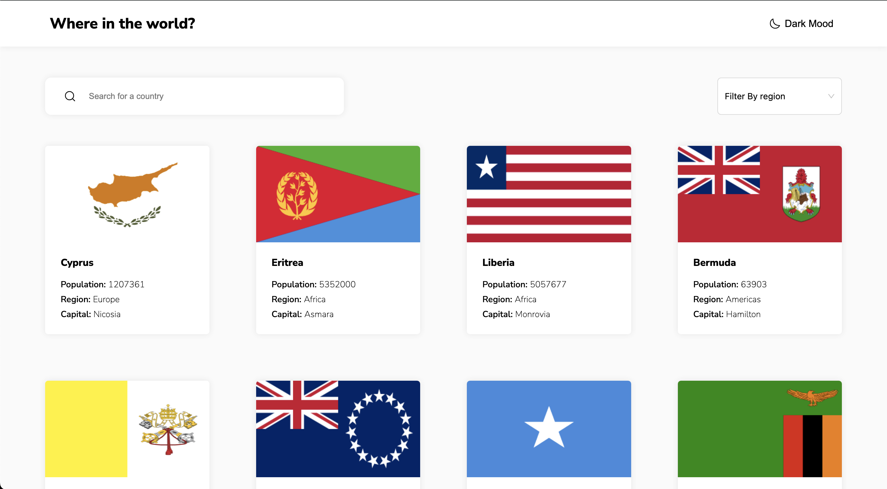

# Frontend Mentor - REST Countries API with color theme switcher solution

This is a solution to the [REST Countries API with color theme switcher challenge on Frontend Mentor](https://www.frontendmentor.io/challenges/rest-countries-api-with-color-theme-switcher-5cacc469fec04111f7b848ca). Frontend Mentor challenges help you improve your coding skills by building realistic projects.

## Table of contents

- [Overview](#overview)
    - [The challenge](#the-challenge)
    - [Screenshot](#screenshot)
    - [Links](#links)
- [My process](#my-process)
    - [Built with](#built-with)
    - [What I learned](#what-i-learned)
    - [Continued development](#continued-development)
    - [Useful resources](#useful-resources)
- [Author](#author)

## Overview

### The challenge

Users should be able to:

- See all countries from the API on the homepage
- Search for a country using an `input` field
- Filter countries by region
- Click on a country to see more detailed information on a separate page
- Click through to the border countries on the detail page
- Toggle the color scheme between light and dark mode *(optional)*

### Screenshot



### Links

- Solution URL: [Solution URL](https://github.com/amjadsh97/rest-countires-api)
- Live Site URL: [Live site](https://rest-countires-api.vercel.app/)

## My process

### Built with

- Semantic HTML5 markup
- CSS custom properties
- Flexbox, Grid layout
- [React](https://reactjs.org/) - JS library
- [antd](https://ant.design/) - React UI library

### What I learned

About the dark mode I make some custom properties as shown here. when the user click on theme button the 
app add the class "is-dark" to the body and I change the those custom properties. Also I stored the theme on local storage
so the user can save his theme after close the website.

#### Javascript code
```js
const handleChangeTheme = () => {
	if (currentTheme === "light") {
		setCurrentTheme("dark")
		localStorage.setItem("theme", "dark")
	} else {
		setCurrentTheme("light")
		localStorage.setItem("theme", "light")
	}
}

useEffect(() => {
	if (localStorage.getItem("theme") === "dark") {
		document.querySelector("body").classList.add("is-dark")
	} else {
		document.querySelector("body").classList.remove("is-dark")
	}
}, [currentTheme])
```

#### CSS code
```css
:root {
  --bg-2: hsl(0, 0%, 98%);
  --bg-1: hsl(0, 0%, 100%);
  --box-shadow: 0 0 10px #e6e6e6;
  --box-shadow-hover:  0 0 10px #bcbcbc;
  --box-shadow-back-button :0 0 10px #898989;
}

.is-dark {
  --bg-1: hsl(209, 23%, 22%);
  --bg-2: hsl(207, 26%, 17%);
  --box-shadow: 0 0 10px #222;
  --box-shadow-hover: 0 0 10px #666;
  --box-shadow-back-button :0 0 10px #222
}
```

### Continued development

In the future, I will prioritize further developing my skills in utilizing CSS custom properties. I aim to explore the full potential of this remarkable feature and integrate it effectively into my projects.

### Useful resources

- [React Docs](https://react.dev/) - This helped me for building react components. I really liked using this docs.
- [antd docs](https://ant.design/) -
  Ant Design is a React. js UI library that contains easy-to-use components that are useful for building interactive user interfaces.

## Author

- Website - [Amjad Shadid](https://amjadshadid.vercel.app/)
- Frontend Mentor - [@amjadsh97](https://www.frontendmentor.io/profile/amjadsh97)
- Twitter - [@Amjadshadid](https://twitter.com/Amjadshadid)
- Linkedin - [@Amjad Shadid](https://www.linkedin.com/in/amjad-shadid-134355134/)